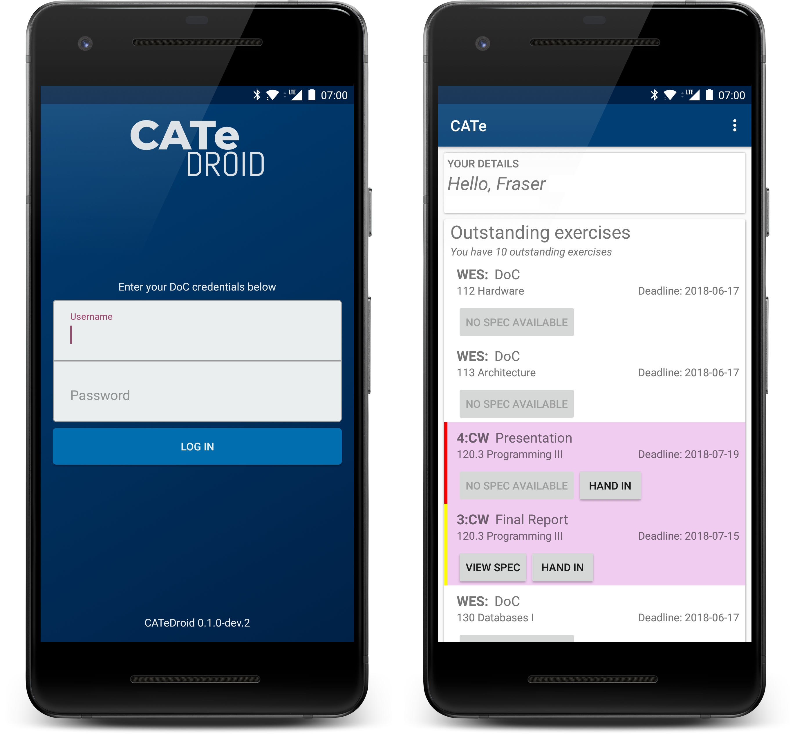

# CATeDroid

CATeDroid is an Android app for use by Imperial College DoC students to interact
with CATe. It is currently in early development, and requires a connection to
the Imperial College network (such as Imperial WiFi or VPN) to work.

## How it works
CATeDroid works by sending requests to a basic API built using
[pycate](https://github.com/docsocsf/pycate), hosted on a DoC Cloud Server.

### Credentials
When you log in, your DoC credentials get encrypted and stored on your local
device. This is necessary due to the way in which CATe handles authentication
(your credentials need to be sent with every request).

Requests between your device and the API server, as well as between the API
server and CATe are handled using HTTPS. Your credentials are **NOT** stored on
our API server.

## Contributing
**Contributions are welcome!**

To contribute code simply fork the repo, make your
changes in a branch in your fork, then open a pull request
[here](https://github.com/docsocsf/catedroid/compare). One of the team
will then review your request and deal with it appropriately.

You can also contribute by submitting bug reports in the
[issues tab](https://github.com/docsocsf/catedroid/issues).

### Continuous Integration
This repository is set up to use CircleCI to run tests. When a commit gets
pushed to any branch, it automatically builds and runs tests on the app.
We encourage you to set up CircleCI on your own forks so that you can see if
your code passes tests before submitting a pull request.

All pull requests get automatically run through the CI checks, and must pass
before they can be merged.
